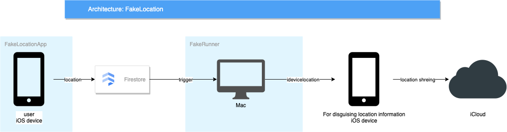

# FakeLocation
FakeLocation is a location spoofing solution.
Share disguised location information to those who share location information in iCloud.



## why is it necessary
Although it is not necessary to share location information,
FakeLocation is useful when you have to share location information for some reason.
Spoofing the location of your regular device with idevicelocation restricts movement because it requires a Mac running idevicelocation. (Although it can be operated with a battery, it depends on the battery capacity.) Since the location information of the terminal is disguised, the use of applications that use real location information such as navigation is restricted. 
By uploading the location information of the terminal you usually use to the cloud, FakeLocation can operate with a stable power supply on the Mac installed at the base.
Since it does not disguise the location information of the execution terminal itself, it is possible to use applications that require real location information such as navigation while disguising the location information.

# System Requirement
- Regular iOS device
- iOS device for location spoofing
- Mac
- idevicelocation
- Firestore

# Getting Started
1. Setting up a Firebase account
1. Build and install FakeLocationApp
1. Build and run FakeRunner
    ```
    cd fake-runner
    npm run build
    npm start
    ``` 
1. Run FakeLocationApp
    
    When you run it, it will start sending location information.

    You can switch between sending real location information or fake location information.